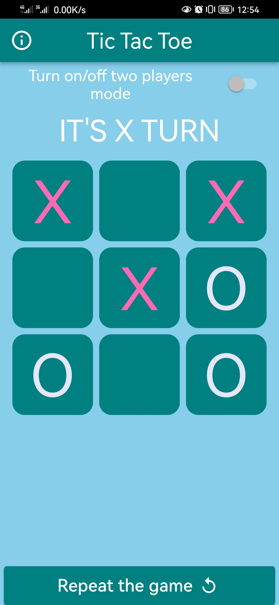
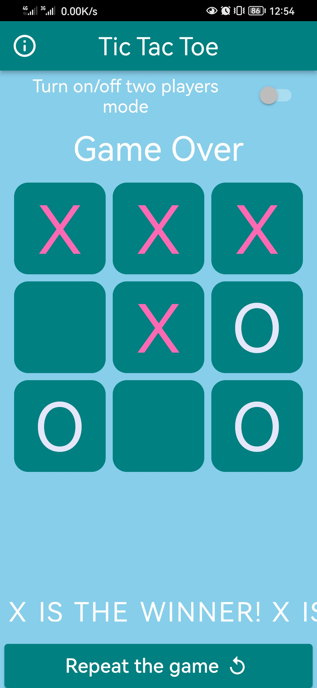

# ❌⭕ XO Game

A simple and fun Flutter tic-tac-toe app with two modes: play with a friend or challenge the bot!

## ✨ Features

- 👥 2 players mode (local)
- 🤖 Single player mode vs CPU
- 🔁 Restart game easily
- 🎨 Clean, minimal UI with game result display

## 📸 Screenshots

  
  

## 📚 Credits

Built while following the excellent course:  
[Flutter & Dart - The Complete Guide](https://www.udemy.com/course/fluttercourse/)

